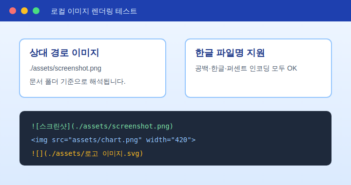
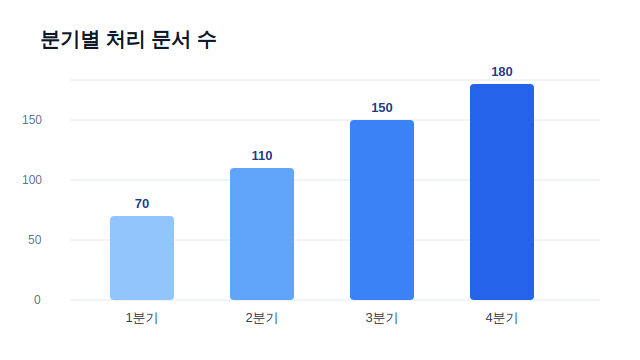
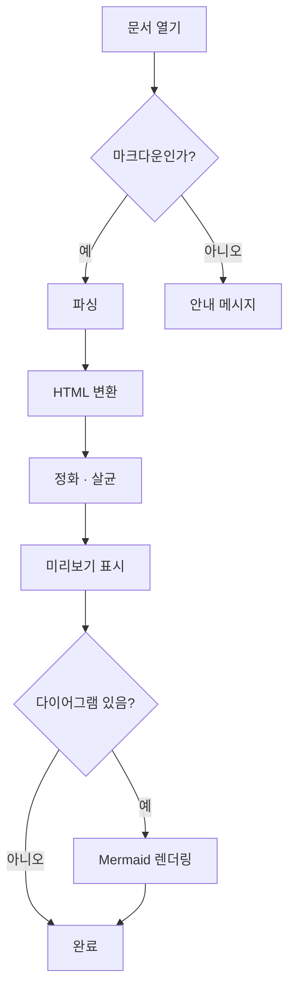
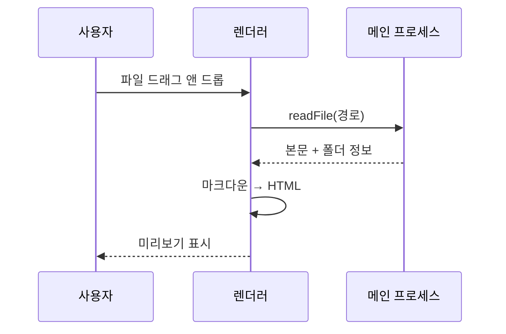
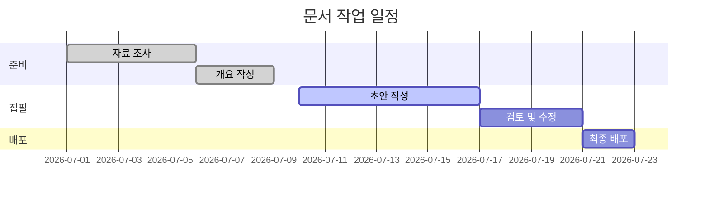
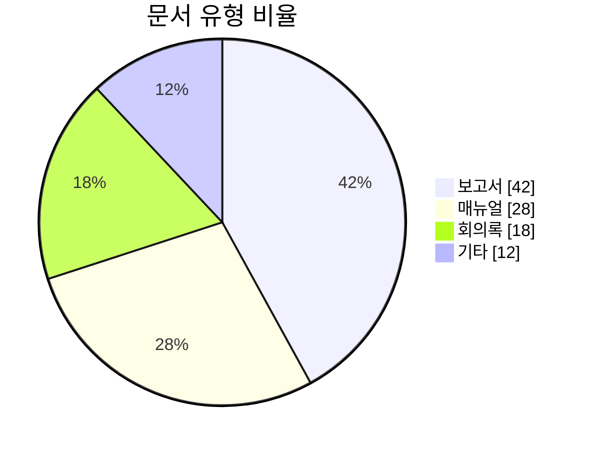
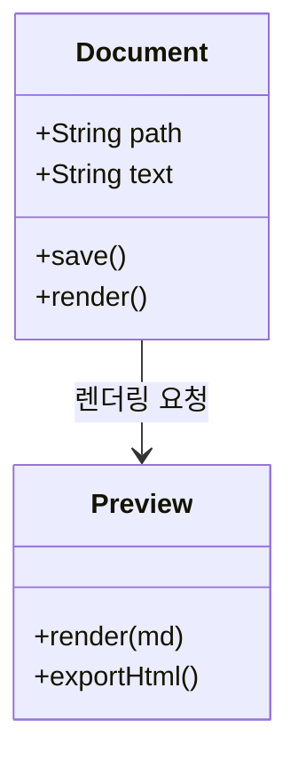
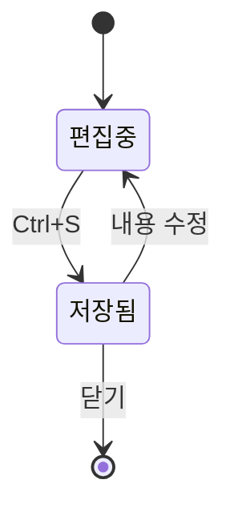

# MarkView 기능 안내 📘

이 문서는 **MarkView** 가 지원하는 모든 표현을 한 번에 확인하기 위한 예제입니다.
Claude 가 만들어 주는 마크다운 문서에서 흔히 쓰이는 요소를 전부 담았습니다.

> 왼쪽에서 이 문서를 편집하면 오른쪽 미리보기가 즉시 바뀝니다.
> 왼쪽 **목차** 패널에서 원하는 절로 바로 이동할 수 있습니다.

---

## 1. 글자 서식

**굵게**, *기울임*, ***굵은 기울임***, ~~취소선~~, `인라인 코드`,
==형광펜==, H~2~O, x^2^, <kbd>Ctrl</kbd> + <kbd>S</kbd>.

자동 링크: https://mermaid.js.org · 이메일: someone@example.com

각주도 지원합니다.[^각주1]

[^각주1]: 각주는 문서 맨 아래에 모아서 표시됩니다.

---

## 2. 목록과 체크리스트

### 순서 없는 목록

- 첫 번째 항목
  - 중첩된 항목
    - 더 깊은 항목
- 두 번째 항목

### 순서 있는 목록

1. 문서를 연다
2. 편집한다
3. `Ctrl+S` 로 저장한다

### 체크리스트

미리보기에서 체크박스를 직접 눌러 보세요. **원본 마크다운도 함께 바뀝니다.**

- [x] 이미지 렌더링
- [x] Mermaid 다이어그램
- [x] 수식(KaTeX)
- [ ] 아직 안 한 일

### 정의 목록

마크다운
: 읽기 쉬운 서식 문법

Mermaid
: 텍스트로 다이어그램을 그리는 문법

---

## 3. 표

| 기능 | 지원 | 비고 |
| :--- | :---: | ---: |
| GFM 표 | ✅ | 정렬·가로 스크롤 지원 |
| 체크리스트 | ✅ | 클릭하면 원본도 수정 |
| 각주 | ✅ | 문서 하단에 정리 |
| 수식 | ✅ | KaTeX |
| 다이어그램 | ✅ | Mermaid 11 |
| 로컬 이미지 | ✅ | 상대 경로 자동 해석 |

---

## 4. 이미지

### 상대 경로 이미지 (PNG)



### 공백·한글이 들어간 파일명 (SVG)


### HTML 태그로 크기 지정



### 인라인 data URI


> 이미지를 찾지 못하면 빨간 점선 테두리로 표시되므로 경로 오류를 바로 알 수 있습니다.

---

## 5. Mermaid 다이어그램

### 순서도 (flowchart)



### 시퀀스 다이어그램



### 간트 차트



### 파이 차트



### 클래스 다이어그램



### 상태 다이어그램



---

## 6. 수식 (KaTeX)

인라인 수식: 아인슈타인의 $E = mc^2$ 와 이차방정식의 근 $x = \frac{-b \pm \sqrt{b^2-4ac}}{2a}$.

블록 수식:

$$
\int_{-\infty}^{\infty} e^{-x^2}\,dx = \sqrt{\pi}
$$

$$
\begin{pmatrix} a & b \\ c & d \end{pmatrix}
\begin{pmatrix} x \\ y \end{pmatrix}
=
\begin{pmatrix} ax + by \\ cx + dy \end{pmatrix}
$$

통화 표기는 수식으로 오해하지 않습니다: 이 제품은 $100 이고 저 제품은 $250 입니다.

---

## 7. 코드 블록

```python
def fibonacci(n: int) -> list[int]:
    """피보나치 수열을 n개 생성한다."""
    seq = [0, 1]
    while len(seq) < n:
        seq.append(seq[-1] + seq[-2])
    return seq[:n]

print(fibonacci(10))
```

```javascript
const 문서목록 = await fetch('/api/docs').then((r) => r.json());
문서목록
  .filter((doc) => doc.type === 'markdown')
  .forEach((doc) => console.log(`${doc.name} (${doc.size} bytes)`));
```

```sql
SELECT d.name, COUNT(*) AS 개수
FROM documents d
JOIN revisions r ON r.doc_id = d.id
WHERE d.created_at >= '2026-01-01'
GROUP BY d.name
ORDER BY 개수 DESC;
```

```bash
# 설치 후 실행
npm install
npm run dist:win
```

```diff
- 이전 방식은 이미지를 표시하지 못했습니다.
+ MarkView 는 상대 경로 이미지를 그대로 표시합니다.
```

코드 블록 오른쪽 위의 **복사** 버튼으로 전체 코드를 클립보드에 담을 수 있습니다.

---

## 8. 인용과 구분선

> ### 인용 안의 제목
>
> 인용 블록 안에서도 **서식**과 `코드`, 목록이 모두 동작합니다.
>
> 1. 첫째
> 2. 둘째
>
> > 중첩 인용도 됩니다.

---

## 9. HTML 직접 사용

<details>
<summary>접었다 펼 수 있는 영역 (클릭)</summary>

안에는 마크다운이 아닌 **HTML** 이 들어갑니다.
스크립트나 iframe 같은 위험한 태그는 자동으로 제거됩니다.

</details>

<div align="center">
  <b>가운데 정렬된 HTML 블록</b>
</div>

---

## 10. 문서 사이 링크

- [보고서 예시 문서 열기](./보고서-예시.md) — 클릭하면 새 탭으로 열립니다.
- [문서 맨 위로](#markview-기능-안내-)

---

## 마무리

| 단축키 | 기능 |
| --- | --- |
| `Ctrl+O` | 열기 |
| `Ctrl+S` | 저장 |
| `Ctrl+P` | PDF 내보내기 |
| `Ctrl+1/2/3` | 편집 / 분할 / 미리보기 |
| `Ctrl+\` | 목차 패널 |
| `Ctrl+Shift+T` | 테마 전환 |

전체 단축키는 **도움말 › 단축키** 에서 볼 수 있습니다.
