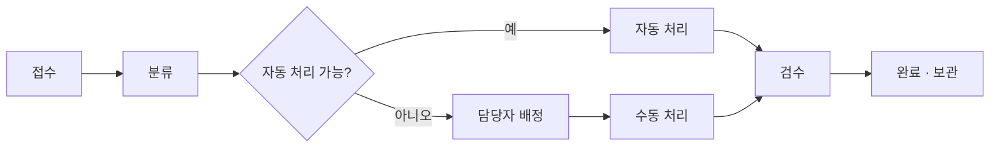

# 2026년 상반기 문서 처리 현황 보고

작성자: 운영팀 · 작성일: 2026-07-31

## 요약

상반기 문서 처리량은 전년 동기 대비 **38% 증가**했습니다.
자동화 도입 이후 평균 처리 시간이 4.2일에서 1.6일로 단축되었습니다.

## 처리 흐름

## 지표

| 구분 | 2025 상반기 | 2026 상반기 | 증감 |
| --- | ---: | ---: | ---: |
| 접수 건수 | 3,120 | 4,306 | +38.0% |
| 평균 처리일 | 4.2일 | 1.6일 | −61.9% |
| 자동 처리 비율 | 21% | 67% | +46%p |
| 반려율 | 8.4% | 3.1% | −5.3%p |

처리 효율은 다음과 같이 정의했습니다.

$$
\text{효율} = \frac{\text{자동 처리 건수}}{\text{전체 접수 건수}} \times 100
$$

## 다음 분기 계획

- [x] 자동 분류 모델 고도화
- [x] 반려 사유 표준화
- [ ] 외부 기관 연계 API 개통
- [ ] 담당자 교육 자료 배포

[기능 안내 문서로 돌아가기](./기능-안내.md)
